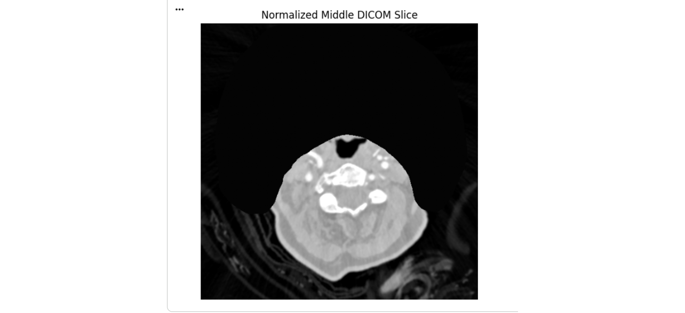
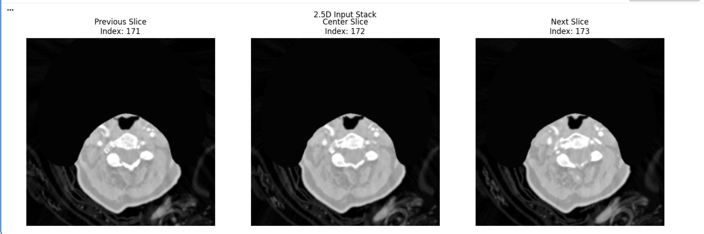
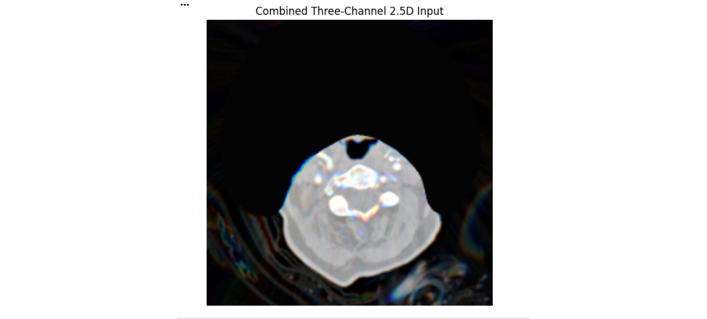
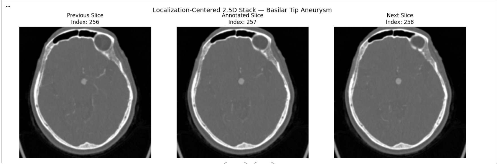
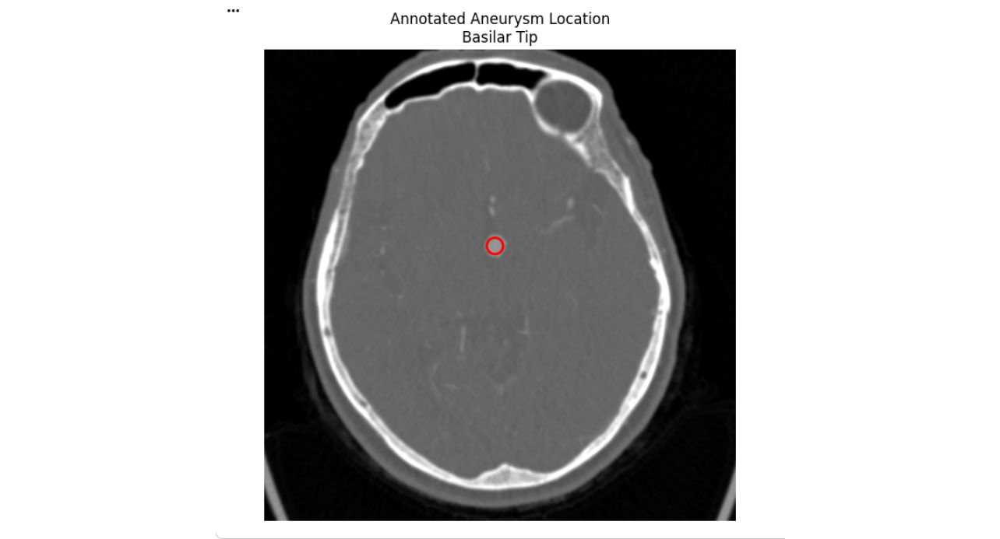

# 🧠 Intracranial Aneurysm Detection Using Deep Learning


---

# ⭐ Project Highlights

- Developed an end-to-end deep learning pipeline for intracranial aneurysm detection from DICOM CT angiography images.
- Performed DICOM preprocessing, normalization, exploratory medical image analysis, and visualization.
- Generated localization-aware **2.5D image inputs** using neighboring CT slices and expert aneurysm annotations.
- Fine-tuned an **EfficientNet-B0** transfer learning model for binary aneurysm classification.
- Evaluated model performance using **ROC-AUC, Precision, Recall, F1-score, Confusion Matrix, and Threshold Analysis.**
- Built clinical visualization utilities to compare predictions with radiologist annotations.
- Demonstrated an AI-assisted workflow for medical image screening and computer-aided diagnosis.

---

# 📂 Repository Structure

```
Intracranial-Aneurysm-Detection/

│── rsna-intracranial-aneurysm-detection-portfolio.ipynb
│── README.md
│── requirements.txt
│
├── images/
│ └── README.md
│
└── docs/
└── README.md
```

---

# 📖 Project Overview

Intracranial aneurysms are weakened blood vessel walls inside the brain that may rupture and cause life-threatening hemorrhagic strokes. Early detection from CT Angiography (CTA) images is challenging because aneurysms are often very small and can resemble surrounding vessels.

This project develops an end-to-end deep learning workflow for automated aneurysm detection using the RSNA Intracranial Aneurysm Detection Challenge dataset. The pipeline combines DICOM preprocessing, localization-aware data preparation, transfer learning, and comprehensive evaluation to demonstrate how artificial intelligence can support radiologists during medical image interpretation.

---

# 🏥 Clinical Background

Brain aneurysms affect millions of people worldwide, yet many remain undiagnosed until rupture.

Challenges include:

- Extremely small lesion sizes
- Large volumetric CT studies
- High similarity between aneurysms and normal blood vessels
- Significant class imbalance

Artificial Intelligence can assist radiologists by:

- Prioritizing suspicious examinations
- Reducing missed aneurysms
- Improving screening efficiency
- Supporting clinical decision making

---

# 📊 Dataset

**Competition**

RSNA Intracranial Aneurysm Detection Challenge

Dataset consists of:

- CT Angiography (CTA) scans
- DICOM medical images
- Expert radiologist annotations
- Localization coordinates
- Binary aneurysm labels

---

## 🧠 Sample Brain CT Slice

The dataset consists of DICOM brain CT angiography images. Below is an example slice visualized during preprocessing.

<p align="center">
  
</p>

## 🖼️ Image Preprocessing

Medical CT angiography images undergo intensity normalization and preprocessing before model training. This process standardizes pixel values across scans, reduces variability, and provides consistent inputs for the deep learning pipeline.

<p align="center">
  
</p>

## 🧩 2.5D Input Generation

Instead of using a single CT slice, the model constructs a 2.5D representation by combining the previous, center, and next slices into a three-channel input. This provides additional anatomical context while remaining computationally efficient compared to full 3D volumes.

<p align="center">
  
</p>

## 🧠 Combined 2.5D Model Input

The three adjacent CT slices are combined into a single three-channel (RGB-like) tensor that serves as the model's input. This representation captures spatial context from neighboring slices while remaining computationally efficient compared to full volumetric (3D) processing.

<p align="center">
  
</p>

## 🎯 Localization-Centered 2.5D Stack

For each annotated aneurysm, the pipeline extracts a localization-centered 2.5D stack consisting of the previous, annotated, and next CT slices. This approach focuses the model on the clinically relevant region while preserving anatomical context from neighboring slices.

<p align="center">
  
</p>

## 📍 Ground Truth Aneurysm Annotation

The RSNA dataset provides expert-annotated aneurysm locations. The red marker indicates the annotated basilar tip aneurysm used to generate the localization-centered training samples and supervise the deep learning model.

<p align="center">
  
</p>

## 🔍 Zoomed Aneurysm Localization

To better visualize the annotated lesion, the aneurysm region is magnified around the expert-provided annotation. This close-up highlights the target anatomy used for localization-aware training and demonstrates the precision of the annotation process.

<p align="center">
  
</p>

# ⚙️ Project Workflow

## 1. Data Loading

- Read DICOM studies
- Parse metadata
- Load expert annotations

---

## 2. Medical Image Preprocessing

- DICOM normalization
- Windowing
- Intensity scaling
- Slice ordering
- Missing value handling

---

## 3. Exploratory Data Analysis

- Patient statistics
- Class distribution
- Image dimensions
- Sample visualization
- Annotation analysis

---

## 4. Localization-aware 2.5D Input Generation

Instead of using only one CT slice, the model combines:

- Previous slice
- Current slice
- Next slice

to create richer contextual information while remaining computationally efficient.

---

## 5. Deep Learning Model

Transfer Learning using:

- EfficientNet-B0
- PyTorch
- Binary Cross Entropy Loss
- Adam Optimizer

---

## 6. Model Evaluation

Performance evaluated using:

- ROC-AUC
- Precision
- Recall
- F1 Score
- Accuracy
- Confusion Matrix
- ROC Curve
- Threshold Optimization

---

# 🧰 Technologies Used

- Python
- PyTorch
- EfficientNet-B0
- NumPy
- Pandas
- OpenCV
- pydicom
- Matplotlib
- Scikit-learn
- Jupyter Notebook

---

# 📈 Model Outputs

The notebook includes:

- Medical image visualizations
- DICOM preprocessing examples
- Localization visualization
- Training curves
- ROC Curve
- Confusion Matrix
- Prediction examples
- Clinical threshold analysis

---

# 💡 Key Learnings

This project demonstrates practical experience in:

- Medical Imaging AI
- Deep Learning
- Computer Vision
- Transfer Learning
- DICOM Processing
- Healthcare Machine Learning
- Clinical AI Evaluation
- Explainable Medical AI

---

# 🚀 Future Improvements

Potential enhancements include:

- 3D CNN architectures
- Vision Transformers (ViT)
- MONAI medical imaging framework
- Segmentation-based aneurysm localization
- Ensemble deep learning models
- Clinical deployment using TorchServe

---

# ▶️ Running the Project

Install dependencies

```bash
pip install -r requirements.txt
```

Launch Jupyter Notebook

```bash
jupyter notebook
```

Open

```
rsna-intracranial-aneurysm-detection-portfolio.ipynb
```

---

# 📚 References

- RSNA Intracranial Aneurysm Detection Challenge
- PyTorch Documentation
- EfficientNet Paper
- DICOM Standard

---

# 👨‍💻 Author

**Pareekshith Reddy Adla**

Healthcare AI • Medical Imaging • Computer Vision • Deep Learning • Data Science

---

⭐ If you found this repository helpful, feel free to star it!
